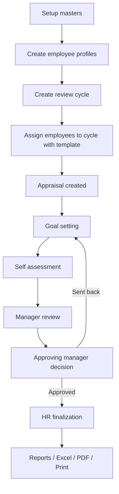

# Employee Performance Appraisal System

## Purpose

This application is a Laravel + React + Inertia employee performance appraisal system that manages the appraisal process from master-data setup through final approval, reporting, Excel export, and PDF generation.

The system is designed as an MVP with a simple relational model, a permission-driven access model, and a transparent workflow.

## Technology Stack

- Backend: Laravel 12
- Frontend: React + TypeScript + Inertia.js
- Database: MySQL
- Permissions: `spatie/laravel-permission`
- Excel export: `openspout/openspout`
- PDF generation: `barryvdh/laravel-dompdf`

## Core Principles

- Roles are database-managed through Spatie and are not hardcoded in controllers or frontend logic.
- Access is controlled through permissions and policies.
- Each employee has at most one appraisal per review cycle.
- Business objectives are weighted and must total `100`.
- Competencies and values are scored separately from business objectives.
- Workflow history and approval decisions are preserved.

## Main Actors

- Employee: plans goals, submits self assessment, adds evidence and comments.
- Line Manager: reviews the appraisal, rates objectives and competencies, sends back or forwards.
- Approving Manager: approves or sends back after manager review.
- HR Admin: maintains setup, manages employees and cycles, can finalize approved appraisals.
- Super Admin: full access across the module and RBAC.

## High-Level Architecture

### Backend domains

- Setup masters: departments, job titles, perspectives, competencies, rating scales, templates, goal library
- Employee management: employee profiles linked to users
- Review cycles: open and closed appraisal periods
- Appraisals: goals, self review, manager review, approval, finalization
- Development plans: strengths, improvement areas, actions
- Reporting: dashboard, summaries, exports, print/PDF
- Access control: users, roles, permissions

### Frontend modules

- `performance/dashboard`
- `performance/setup/*`
- `performance/employees/*`
- `performance/review-cycles/*`
- `performance/templates/*`
- `performance/goal-library/*`
- `performance/appraisals/*`
- `performance/development-plans/*`
- `performance/reports/*`
- `access/users/*`
- `access/roles/*`

## End-to-End Flow



## Step 1: Setup Masters

Before an appraisal can run, the system needs baseline setup data.

### Setup entities

- Departments
- Job Titles
- Perspectives
- Competencies
- Rating Scales and Rating Scale Levels
- Appraisal Templates
- Goal Library Items

### Why these exist

- Departments and job titles organize employees and templates.
- Perspectives classify objectives across Financial, Customer, Internal Process, Learning & Growth, and Behaviours & Values.
- Competencies define non-objective rating criteria.
- Rating scales map selected ratings to numeric values and final labels.
- Templates define the appraisal structure, scoring weights, and included competency items.
- Goal library items provide reusable SMART objective examples.

## Step 2: Employee Setup

Employees are represented in two layers:

- `users`: authentication, account, direct permissions, and assigned roles
- `employee_profiles`: HR and performance-related metadata

### Employee profile information

The employee profile stores:

- employee number
- national ID
- date of birth
- gender
- marital status
- personal phone
- home address
- emergency contact
- department
- job title
- line manager
- approving manager
- employment status
- employment type
- work location
- hire date
- probation and confirmation dates
- review eligibility
- notes

### Important rule

An employee must have an approving manager before the employee can be assigned to a review cycle.

## Step 3: Review Cycle Management

A review cycle defines the period and deadlines for appraisals.

### Review cycle statuses

- `draft`
- `open`
- `closed`

### Typical cycle process

1. HR creates the cycle.
2. HR defines dates and deadlines.
3. HR opens the cycle.
4. HR assigns eligible employees to the cycle with a template.
5. The system creates one appraisal per employee for that cycle.

### Assignment behavior

When employees are assigned:

- the appraisal is created if it does not already exist
- the employee, department, job title, cycle, and template names are snapshotted
- objective and competency child rows are instantiated from the template
- if the cycle is already open, the appraisal starts in `goal_setting`
- if the cycle is still draft, the appraisal starts in `draft`

## Step 4: Goal Planning

Goal planning is the first active stage of an appraisal.

### What happens here

- employee and manager agree SMART objectives
- each objective captures:
  - perspective
  - title
  - KPI / measure
  - target definition
  - weight
  - evidence source
  - due date

### System rule

All business objectives included in the score must add up to exactly `100`.

If the total is not `100`, the system blocks submission of the goal plan.

### Submission result

Once submitted:

- appraisal status changes from `goal_setting` to `self_assessment_pending`
- `goal_submitted_at` is populated
- an approval record and status history row are created

## Step 5: Self Assessment

The employee then completes self assessment.

### Employee actions

- capture performance achieved for each objective
- select a self rating per objective
- add self comments
- record achievement notes and significant issues
- add evidence links or uploaded files
- rate competencies if present

### Validation

At submission time, each objective must have a self rating.

### Submission result

Once submitted:

- appraisal status changes from `self_assessment_pending` to `manager_review_pending`
- `self_assessment_submitted_at` is populated
- manager is notified
- audit records are stored

## Step 6: Manager Review

The line manager performs the formal review.

### Manager actions

- review employee goals and evidence
- assign manager ratings for each objective
- assign manager ratings for each competency
- add manager comments
- either forward for approval or send back for correction

### Validation

At submission time:

- each objective must have a manager rating
- each competency row must have a manager rating if competencies exist

### Forward result

If the manager forwards the appraisal:

- appraisal status changes to `approval_pending`
- `manager_reviewed_at` is populated
- approver is notified
- approval history and status history are stored

### Send-back result

If the manager sends it back:

- appraisal status changes to `sent_back`
- `reopened_stage` is set
- a send-back comment is required
- an approval record and status history row are stored

## Step 7: Final Approval

The approving manager makes the final review decision before HR finalization.

### Approving manager actions

- review the manager-scored appraisal
- inspect comments and evidence
- approve or send back

### Approval result

If approved:

- appraisal status changes to `approved`
- final business, values, and overall scores are calculated
- the final rating scale level is mapped and stored
- `approved_at` is populated
- notifications and audit history are recorded

### Send-back result

If sent back:

- appraisal status changes to `sent_back`
- `reopened_stage` identifies where correction is needed
- the return reason is stored in comments and approval history

## Step 8: Finalization

HR Admin or equivalent finalizes an already approved appraisal.

### Why finalization exists

Approval and finalization are separate by design:

- approval confirms the business decision
- finalization locks the record for reporting and final documentation

### Finalization result

- appraisal status changes to `finalized`
- `finalized_at` is populated
- scoring is refreshed before lock-in
- PDF / print output becomes the final record

## Workflow Statuses

The appraisal lifecycle uses these statuses:

- `draft`
- `goal_setting`
- `self_assessment_pending`
- `self_assessment_submitted`
- `manager_review_pending`
- `manager_review_completed`
- `approval_pending`
- `approved`
- `sent_back`
- `finalized`

### Current implemented route flow

Although all statuses are supported in the domain, the main working progression in the service layer is:

1. `goal_setting`
2. `self_assessment_pending`
3. `manager_review_pending`
4. `approval_pending`
5. `approved`
6. `finalized`

The additional statuses remain part of the broader model and reporting vocabulary.

## Scoring Model

The scoring engine is implemented in `AppraisalScoringService`.

### 1. Business score

Each objective stores a selected rating level and numeric score.

The system:

1. finds the maximum value in the objective rating scale
2. normalizes the manager rating into a percentage
3. multiplies that percentage by the objective weight

Formula:

```text
normalized_percent = (manager_rating_score / objective_scale_max) * 100
objective_weighted_score = normalized_percent * (objective_weight / 100)
business_score = sum(all weighted objective scores)
```

Only objectives marked `include_in_business_score = true` are counted.

### 2. Values / competency score

Competencies are scored separately.

The system:

1. finds the maximum value in the competency rating scale
2. normalizes each manager competency rating into a percentage
3. averages those percentages

Formula:

```text
values_score = average((manager_rating_score / competency_scale_max) * 100)
```

### 3. Final overall score

Templates define the business and values weighting split.

Default MVP weighting:

- business: `80`
- values: `20`

Formula:

```text
overall_score =
((business_score * business_weight_percent) +
(values_score * values_weight_percent)) / 100
```

### 4. Final rating label

The overall score is mapped to an overall rating scale level using `min_percent` and `max_percent`.

The final appraisal stores:

- `business_score`
- `values_score`
- `overall_score`
- `overall_rating_scale_level_id`

## Audit and History

The system keeps workflow history in two ways.

### Appraisal approvals

`appraisal_approvals` stores:

- actor
- stage
- action
- comments
- snapshot
- acted_at

This records workflow decisions such as:

- submitted
- forwarded
- sent back
- approved
- rejected
- finalized

### Status history

`appraisal_status_histories` stores:

- from status
- to status
- actor
- reason
- metadata snapshot
- changed_at

This preserves an audit trail of state changes over time.

## Notifications

Workflow notifications are handled through the `AppraisalStatusChanged` event and `SendAppraisalWorkflowNotifications` listener.

Assignment and milestone reminders also send email when **Settings → Email notifications** is enabled and SMTP is configured.

The system sends database notifications (and email when enabled) for:

- appraisal assigned
- cycle milestone deadline approaching (7, 3, and 1 days before each milestone)
- self assessment submitted
- manager review requested
- approval requested
- appraisal approved
- appraisal sent back
- appraisal finalized

## Permissions and RBAC

The system uses `spatie/laravel-permission`.

### How authorization works

- roles live in the database
- permissions live in the database
- users can have both assigned roles and direct permissions
- policies check permission plus record ownership / reporting relationships

### Important rule

Runtime access is permission-driven. The application does not depend on hardcoded role names inside business logic.

### Permission examples

- `performance.setup.departments.view`
- `performance.employees.create`
- `performance.review_cycles.assign_employees`
- `performance.appraisals.self_assess`
- `performance.appraisals.manager_review`
- `performance.appraisals.approve`
- `performance.appraisals.finalize`
- `performance.reports.export`
- `access.roles.update`
- `access.users.update`

## Reporting

The reporting layer provides:

- dashboard metrics
- cycle summary
- department summary
- employee summary
- completion status
- rating distribution
- overdue reviews

### How reports are filtered

Reports can be filtered by:

- review cycle
- department
- employee profile

### Dashboard metrics

The dashboard includes:

- my open appraisals
- team pending reviews
- pending approvals
- overdue reviews
- open cycles

## Excel Export and PDF Output

### Excel

OpenSpout exports report data to Excel.

The current export endpoints use the same report filters as the onscreen reports.

### PDF

DOMPDF generates a printable appraisal summary from server-side Blade views.

The print flow supports:

- browser print view
- generated PDF view

## Main Routes

### Performance

- `/performance/dashboard`
- `/performance/setup/departments`
- `/performance/setup/job-titles`
- `/performance/setup/perspectives`
- `/performance/setup/competencies`
- `/performance/setup/rating-scales`
- `/performance/review-cycles`
- `/performance/templates`
- `/performance/goal-library`
- `/performance/employees`
- `/performance/appraisals`
- `/performance/development-plans`
- `/performance/reports`

### Access control

- `/access/users`
- `/access/roles`

## Data Model Summary

### Core operational tables

- `employee_profiles`
- `review_cycles`
- `appraisals`
- `appraisal_objectives`
- `appraisal_competency_ratings`
- `appraisal_comments`
- `appraisal_approvals`
- `appraisal_status_histories`
- `development_plans`
- `development_plan_actions`

### Setup tables

- `departments`
- `job_titles`
- `perspectives`
- `competencies`
- `rating_scales`
- `rating_scale_levels`
- `appraisal_templates`
- `appraisal_template_items`
- `goal_library_items`

### Security tables

- `users`
- `roles`
- `permissions`
- Spatie pivot tables for model-role and model-permission relationships

## Seeded Demo Data

The database seeder includes a realistic test dataset using Zimbabwean names and sample employee records.

### Seed contents

- departments and job titles
- users and employee profiles
- active, draft, and closed review cycles
- goal library examples
- appraisals in multiple workflow stages
- approval and history records
- development plan examples

### Example seeded accounts

- `rutendo.moyo@nhaka.test`
- `tariro.chigumira@nhaka.test`
- `tatenda.dube@nhaka.test`
- `rumbidzai.ncube@nhaka.test`

Default password for seeded users:

```text
password
```

## Practical System Walkthrough

### New cycle walkthrough

1. HR creates departments, job titles, scales, and templates if not already present.
2. HR creates or updates employee profiles and ensures managers are assigned.
3. HR creates a review cycle.
4. HR opens the cycle.
5. HR assigns employees to the cycle with a template.
6. The system generates one appraisal per employee.
7. Employees complete goal setting.
8. Employees submit self assessments.
9. Managers complete ratings and forward for approval.
10. Approving managers approve or send back.
11. HR finalizes approved appraisals.
12. Reports, Excel exports, and final PDF summaries are used for tracking and recordkeeping.

### Send-back walkthrough

1. An appraisal reaches manager review or approval.
2. Reviewer finds gaps in evidence or scoring.
3. Reviewer sends the appraisal back with a required comment.
4. System marks the appraisal `sent_back`.
5. System stores the send-back comment, approval action, and status history.
6. The appraisal is corrected and resubmitted from the appropriate stage.

## Extension Points

The current system is intentionally simple. The following can be added later without replacing the core design:

- calibration sessions
- reminder scheduling
- bulk imports
- multi-rater reviews
- acknowledgement signatures
- template versioning
- richer analytics

## Operational Notes

- Use `php artisan db:seed --force` to seed the system with sample data.
- Use the seeded demo data for UI, workflow, export, and reporting tests.
- If review-cycle assignment fails, check whether the employee has an approving manager.
- If goal submission fails, check whether business objective weights total `100`.
- If manager review submission fails, check that all manager ratings are present.

## Summary

This system supports the full appraisal journey:

- configure the organization
- define employees and reporting lines
- open a cycle
- generate appraisals
- plan and assess goals
- review and approve performance
- finalize results
- report and export outcomes

The implementation is intentionally simple, auditable, permission-driven, and ready for iterative extension.
